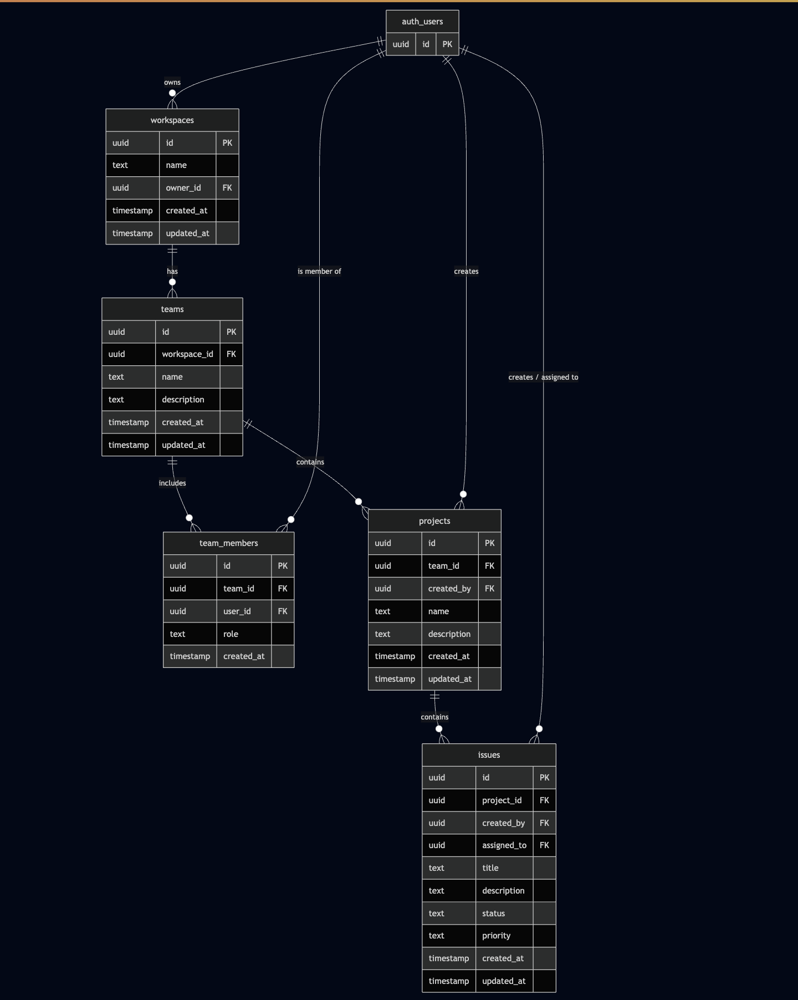

# Database Schema

Defines the minimum viable data model for:

- Workspaces
- Teams
- Team members
- Issues

User accounts and authentication are handled by **Supabase Auth**, not stored manually in the application database.

---

## Entity Relationship Overview

- A **Workspace** contains multiple **Teams**.
- A **Team** has multiple **Members** and **Issues**.
- Each **Issue** is created by a **User** (via Supabase Auth) and can optionally be assigned to another **User**.
- A **User** can belong to multiple **Teams** across different Workspaces.

---

## External Authentication

Supabase manages all user accounts via its **`auth.users`** system table.

- Each reference to a user (`created_by`, `assigned_to`, `owner_id`, etc.) links to `auth.users.id`.
- Application tables should not duplicate user data; only store references (UUIDs).

---

Here are only the **tables** from the updated schema:

---

### **workspaces**

| Column       | Type                         | Description                    |
| ------------ | ---------------------------- | ------------------------------ |
| `id`         | `uuid` (PK)                  | Unique workspace ID            |
| `owner_id`   | `uuid` (FK → auth.users.id)` | Workspace owner                |
| `name`       | `text`                       | Workspace name                 |
| `created_at` | `timestamp`                  | Auto-generated creation time   |
| `updated_at` | `timestamp`                  | Auto-updated modification time |

---

### **teams**

| Column         | Type                         | Description               |
| -------------- | ---------------------------- | ------------------------- |
| `id`           | `uuid` (PK)                  | Unique team ID            |
| `workspace_id` | `uuid` (FK → workspaces.id)` | Parent workspace          |
| `name`         | `text`                       | Team name                 |
| `description`  | `text`                       | Optional team description |
| `created_at`   | `timestamp`                  | Creation time             |
| `updated_at`   | `timestamp`                  | Update time               |

---

### **team_members**

| Column       | Type                         | Description                            |
| ------------ | ---------------------------- | -------------------------------------- |
| `id`         | `uuid` (PK)                  | Unique membership record ID            |
| `team_id`    | `uuid` (FK → teams.id)`      | Associated team                        |
| `user_id`    | `uuid` (FK → auth.users.id)` | Member user                            |
| `role`       | `text`                       | Role in the team (e.g., member, admin) |
| `created_at` | `timestamp`                  | Join date                              |

---

### **projects**

| Column        | Type                         | Description                     |
| ------------- | ---------------------------- | ------------------------------- |
| `id`          | `uuid` (PK)                  | Unique project ID               |
| `team_id`     | `uuid` (FK → teams.id)`      | Team that owns this project     |
| `created_by`  | `uuid` (FK → auth.users.id)` | Creator (must be a team member) |
| `name`        | `text`                       | Project name                    |
| `description` | `text`                       | Optional project description    |
| `created_at`  | `timestamp`                  | Creation time                   |
| `updated_at`  | `timestamp`                  | Update time                     |

---

### **issues**

| Column        | Type                         | Description                  |
| ------------- | ---------------------------- | ---------------------------- |
| `id`          | `uuid` (PK)                  | Unique issue ID              |
| `project_id`  | `uuid` (FK → projects.id)`   | Associated project           |
| `created_by`  | `uuid` (FK → auth.users.id)` | Creator (team member)        |
| `assigned_to` | `uuid` (FK → auth.users.id)` | Optional assignee            |
| `title`       | `text`                       | Issue title                  |
| `description` | `text`                       | Detailed issue description   |
| `status`      | `text`                       | e.g. open, in_progress, done |
| `priority`    | `text`                       | e.g. low, medium, high       |
| `created_at`  | `timestamp`                  | Creation time                |
| `updated_at`  | `timestamp`                  | Update time                  |

---

## Notes

- **Supabase Auth** manages all user data; this schema references `auth.users.id` for ownership and membership.
- **Workspaces** own **Teams**.
- **Teams** own **Members** and **Issues**.
- Foreign keys cascade deletions to maintain referential integrity.
- Deleting a user sets `created_by` or `assigned_to` to `NULL` to preserve issue history.
